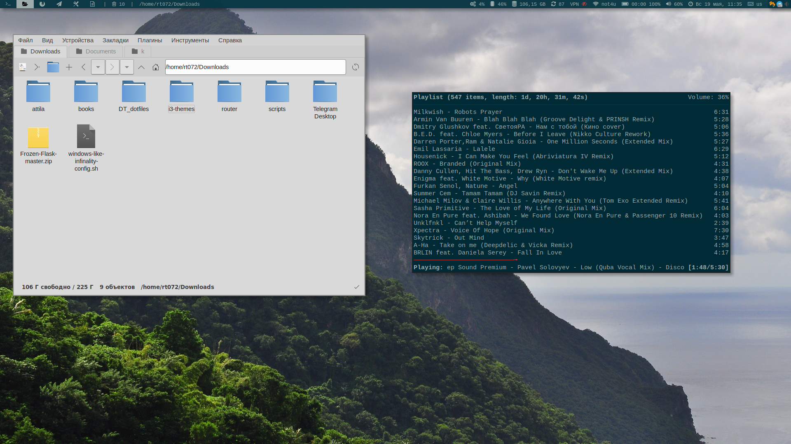

## i3 wm - tiling window manager

### Installation

```bash
cd /home/$USER/.config/i3
git clone https://github.com/rt072/i3.git
mv polybar/ /home/$USER/.config/
```
And add to *.xinitrc*
```
exec i3
```


### Screenshots
Desktop with spacefm and terminal.


* Tags list 
* Trash info. Display how many items in Trash. Right click to clear. 
* List windows 
* System info. CPU usage, RAM used, Free space in root dir, updates availalble, wifi SSID info, Battery info, Volume info, Date, Keyboard layout and Systray.
    


